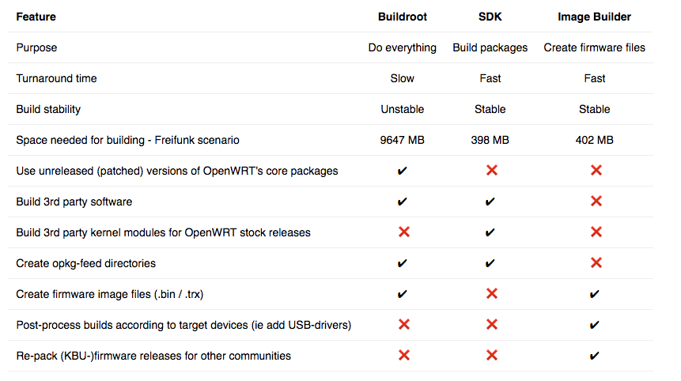

# How to create a firmware?


### Make It - The buildroot

OpenWrt features a build system (aka Buildroot - [https://wiki.openwrt.org/doc/howto/build](https://wiki.openwrt.org/doc/howto/build)). It is used to build OpenWrt from source, completely. You can do it like this:

```
$ git clone git://git.openwrt.org/openwrt.git
$ cd openwrt
$ scripts/feeds update -a && scripts/feeds install -a
$ make menuconfig  # Select all options you need
$ make clean install
```

Using the Buildroot is annoying. You have to wait a long time for the build to finish. Each and every dependency is downloaded, checked, extracted, built and installed. If one thing screws up, the build breaks.

Luckily, there are other options:

* The [OpenWrt SDK](https://wiki.openwrt.org/doc/howto/obtain.firmware.sdk) for compiling software
* The [Image Builder](https://wiki.openwrt.org/doc/howto/obtain.firmware.generate) for creating firmware image files

Both are created when compiling the Buildroot. By using them, you can create images based on released kernel configurations.

### The OpenWrt SDK

The SDK is used for building packages - in contrast to complete firmware files. Starting with OpenWrt 14.07 (Barrier Breaker), it is possible to build kernel packages. Platform-dependent, binary version are provided by OpenWrt for their stock releases.

Let's compile a pre-release of olsr v2 (tag: v0.7.1) to be used on a TP-Link WR841n:

```
$ wget https://downloads.openwrt.org/barrier_breaker/14.07/ar71xx/generic/OpenWrt-SDK-ar71xx-for-linux-x86_64-gcc-4.8-linaro_uClibc-0.9.33.2.tar.bz2
$ tar xjf OpenWrt-SDK-ar71xx-for-linux-x86_64-gcc-4.8-linaro_uClibc-0.9.33.2.tar.bz2
$ cd OpenWrt-SDK-ar71xx-for-linux-x86_64-gcc-4.8-linaro_uClibc-0.9.33.2
$ git clone git://olsr.org/oonf.git -b v0.7.1 package/oonf
$ make world
```

Looking into `./ar71xx/packages/base`, there's a complete [opkg-feed](https://wiki.openwrt.org/doc/techref/opkg). Just copy it to a web server, put it in your router's `/etc/opkg.conf` and use it.

### Image Builder

The Image Builder is for creating firmware images to be uploaded on routers. Sometimes it's called Image Generator. It's for post-processing a Build-output, such as an OpenWrt stock release. You can select packages and files to be included. Creating a minimal image including the previous olsr v2 build for a TP-Link WR841n works like this:

```
$ wget https://downloads.openwrt.org/barrier_breaker/14.07/ar71xx/generic/OpenWrt-ImageBuilder-ar71xx_generic-for-linux-x86_64.tar.bz2
$ tar xjf OpenWrt-ImageBuilder-ar71xx_generic-for-linux-x86_64.tar.bz2
$ cd OpenWrt-ImageBuilder-ar71xx_generic-for-linux-x86_64
$ #### Append to repositories.conf: src/gz my_packages https://your.web.server/uploaded/sdk_output/
$  make image PROFILE=TLWR841 PACKAGES="olsrv2"
```

Result is: `./bin/ar71xx/openwrt-ar71xx-generic-tl-wr841n*`. Keep in mind that `make profile` gives a list of all avaiblable profiles for the sdk's platform. There are generic ones.

### Summary

SDK + ImageBuilder seems to be a reasonable choice: software packages released by OpenWrt can be used and post-processing allows including USB-drivers only for models having USB. Building a non-released version of OpenWrt (trunk, stable branch) seems to be one of the few cases, where you actually need the Buildroot.



[Image source](https://kbu.freifunk.net/2015/04/Building-OpenWRT/)

### Reference

* [https://kbu.freifunk.net/2015/04/Building-OpenWRT/](https://kbu.freifunk.net/2015/04/Building-OpenWRT/)
