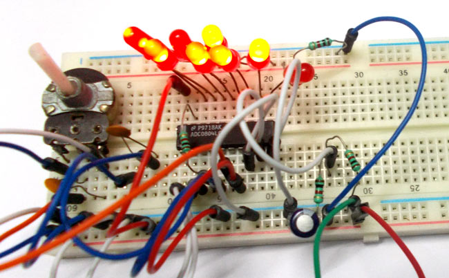
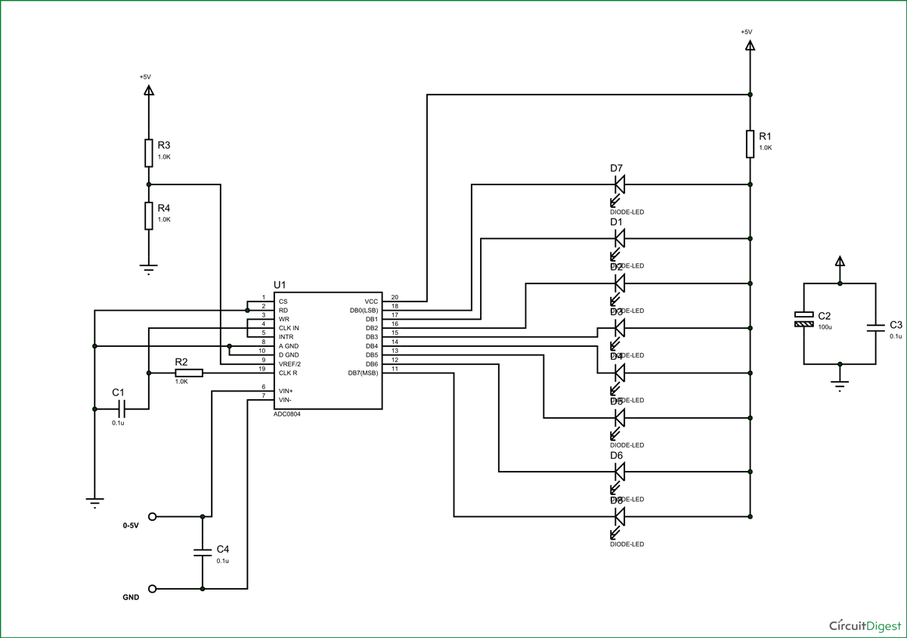
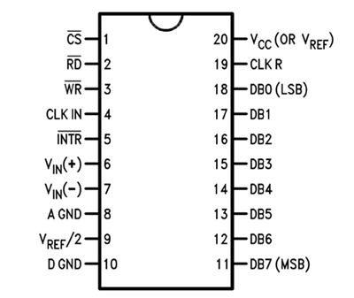

# Introduction to ADC0804

We know all the parameters of nature are of analog. That means they vary continuously over time. Say for an instance temperature of the room. The room temperature varies with time continuously. This signal which changes with time continuously say from 1sec, 1.1sec, 1.2 sec … is called ANALOG signal. The signal which changes its quantity over duration of internals and keeps its value constant during the transition period say from 1sec to 2sec, is called DIGITAL signal.

The Analog signal can change its value at 1.1 sec; the digital signal cannot change the value during this time as it is between the intervals of time. We need to know the difference because the Analog signals of nature cannot be processed by computers or digital circuits. The computers can only processes digital data because of clock, the quicker the clock greater the processing speed, lesser the transition times of Digital signals.

Now we know the nature is analog and processing systems need digital data to process and store. For bridging the gap we have ADC or Analog to Digital Converstion. ADC is a technique used to convert analog signals to digital data.

 Here we are going to talk about **ADC0804**. This is a chip designed to convert analog signal in to 8 bit digital data. This chip is one of the popular series of ADC.

Image source from [here](https://circuitdigest.com/electronic-circuits/adc0804-introduction)

ADC0804 is an 8bit conversion unit, so we have 2^8 (256) values or 0 to 255. With a measuring voltage of maximum 5V, we will have a change for every 19.5 mV. Below is the **Pinout** of ADC0804. Now another important thing here is, the **ADC0804 operates at 5V** and so it provides output in 5V logic signal. In 8 pin output (representing 8bits), every pin provides +5V output to represent logic '1'. Higher the measuring voltage there will be decrease in resolution and accuracy.

The connections which are done for measuring a voltage of  0-5v are shown in the circuit diagram. It works on supply voltage of +5v and can measure a variable voltage range in 0-5V range.

Image source from [here](https://circuitdigest.com/electronic-circuits/adc0804-introduction)

The ADC always have lots of noise, this noise can greatly affect the performance so we use 100uF capacitor for noise filtration. Without this there will a lot of fluctuations at output.

The chip basically has following pins:

Image source from [here](https://circuitdigest.com/electronic-circuits/adc0804-introduction)

The input analog signal has a limit to its value. This limit is determined by reference value and chip supply voltage. The measuring voltage cannot be greater than reference voltage and chip supply voltage. If the limit is crossed, say Vin > Vref, the chip gets faulted permanently.

Now on PIN9 one can see the name Vref/2. That means say we want to measure an analog parameter with a maximum value of 5V, we need Vref as 5V for that we need to provide a voltage of 2.5V (5V/2) at the PIN9. That’s what it says. Here we are going to feed a 5V variable voltage for measuring so we will give a voltage of 2.5V at PIN9 for Vref of 5V.

The chip works on RC (Resistor Capacitor) oscillator clock. As shown in circuit diagram, C1 and R2 form a clock. The important thing to remember here is the capacitor C1 can be changed to a lower value for higher rate of ADC conversion. However with speed there will be a decrease in accuracy.

So if the application requires higher accuracy choose the capacitor with higher value. For higher speed choose lower value capacitor. On 5V ref. If an analog voltage of 2.3V is given for ADC conversion we will have `2.3*(256/5)= 117`. This will be the digital output of ADC0804. So for every increment of 19.5mv at measuring input there will be digital increment at the output of chip. This data can be directly fed in to processing unit for storage or usage.

## Reference

- [Introduction to ADC0804](https://circuitdigest.com/electronic-circuits/adc0804-introduction)

