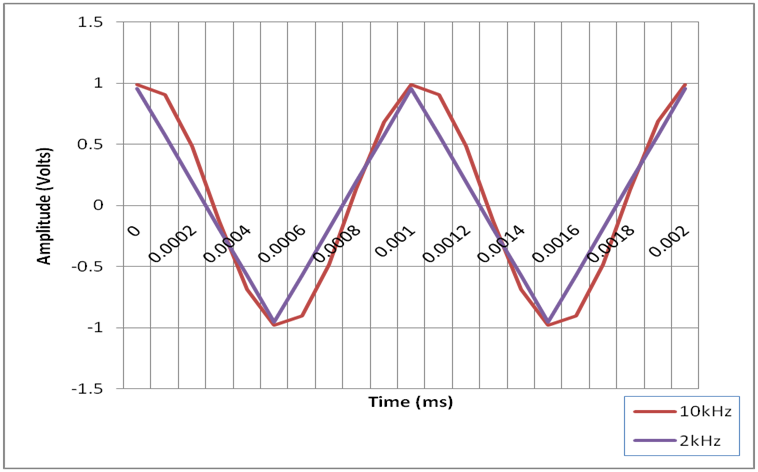
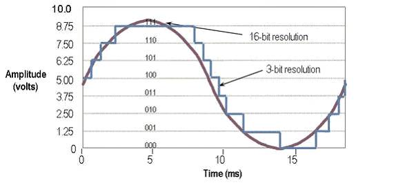

# How to Choose the Right Data Acquisition (DAQ) Hardware

## What types of signals to measure?

A sensor is a device that converts a physical phenomenon into a measurable 
electrical signal, such as voltage or current. You can also send a measurable 
electrical signal to your sensor to create a physical phenomenon. For this 
reason, it is important to understand the different types of signals and 
their corresponding attributes.

### Functions of DAQ Devices

- Analog inputs measure analog signals
- Analog outputs generate analog signals
- Digital inputs/outputs measure and generate digital signals
- Counter/timers count digital events or generate digital pulses/signals

You can find DAQ devices with a fixed number of channels for a single 
function, including analog inputs, analog outputs, digital inputs/outputs, 
or counters; however, you should consider purchasing a device with more 
channels than you currently need so that you can increase channel count if
necessary.

Multifunction DAQ devices have a fixed channel count, but offer a combination
of analog inputs, digital inputs/outputs, and counters. Multifunction devices
support different types of I/O.

## 2. Do I need signal conditioning?

A typical general-purpose DAQ device can measure or generate +/-5V or +/- 10V. 
Some sensors generate signals too difficult of dangerous to measure directly 
with this type of DAQ device. Most sensors require signal conditioning, like 
amplifilcation or filtering, before a DAQ device can effectively and accurately 
measure the signal.

For example, thermocouples output signals in the mV range that require 
amplification to optimize the limits of the analog-to-digital converters (ADC). 
Additionally, thermocouple measurements benefit from lowpass filitering to
remove high-frequency noise. Singal conditioning provides a distinct advantage 
over DAQ devices alone because it enhances both the performance and measurement 
accuracy of DAQ systems.

## 3. How fast do I need to acquire or generate samples of the signal?

One of the most important specifications of a DAQ device is the sampling rate,
which is the speed at which the DAQ device's ADC takes samples of a signal.
Typical smapling rates are either hardware- or software-timed and are up to
rates of 2 MS/s. The smapling rate for your application depends on the maximum
frequency component of the signal that you are tyring to measure or generate.

The Nyquist Theorem states that you can accurately reconstruct a signal by 
sampling two times the highest frequency component of interest. However, in
practice, you should sample at least 10 times the maximum frequency to represent
the shape of your signal. Choosing a DAQ device with a sample rate at least 
10 times the frequency of your signal ensures that you measure or generate a 
more accurate representation of your signal.

For example, suppose in your application you want to measure a sine wave that 
has a frequency of 1 kHz. According to the Nyquist Theorem, you must sample at
2 kHz at least but it is highly recommended to sample at 10 kHz to measure or 
generate a more accurate representation of your signal. Figure 1 compares a 
1 kHz sine wave measured at 2 kHz and 10 kHz.

Image resource from [here](http://www.ni.com/white-paper/13655/en/)

## 4. What is the smallest change in the signal?

The smallest detectable change in the signal determines the resolution that
is required of your DAQ device. Resolution refers to the number of binary
levels an ADC can use to represent a signal. Figure 2 compares a 3-bit ADC 
and a 16-bit ADC. A 3-bit ADC can represent eight (23) discrete voltage 
levels. A 16-bit ADC can represent 65,536 (216) discrete voltage levels. 
The representation of the sine wave with a 3-bit resolution looks more 
like a step function than a sine wave where the 16-bit ADC provides a 
clean-looking sine wave.

Image resource from [here](http://www.ni.com/white-paper/13655/en/)

Typical DAQ devices have voltage ranges of +/-5 V or +/-10 V. The voltage 
levels that can be represented are distributed evenly across a selected range 
to take advantage of the full resolution. For example, a DAQ device with a 
+/-10 V range and 12 bits of resolution (212 or 4,096 evenly distributed 
levels) can detect a 5 mV change, where a device with 16 bits of resolution 
(216 or 65,536 evenly distributed levels) can detect a 300 µV change.

## 5. How much measurement error does my application allow?

Accuracy is defined as a measure of the capability of an instrument to faithfully indicate the value of a measured signal. This term is not related to resolution; however, accuracy can never be better than the resolution of the instrument. How you specify the accuracy of your measurement depends on the type of measurement device. An ideal instrument always measures the true value with 100 percent certainty, but in reality, instruments report a value with an uncertainty specified by the manufacturer. The uncertainty can depend on many factors, such as system noise, gain error, offset error, and nonlinearity. A common specification for a manufacturer’s uncertainty is absolute accuracy. This specification provides the worst-case error of a DAQ device at a specific range. An example calculation for a National Instruments multifunction device’s absolute accuracy is given below:

Absolute Accuracy = ([Reading*Gain Error] + [Voltage Range*Offset Error] + Noise Uncertainty)

Absolute Accuracy = 2.2 mV

It is important to note that an instrument’s accuracy depends not only on the instrument, but also on the type of signal being measured. If the signal being measured is noisy, the measurement’s accuracy is adversely affected. There are wide ranges of DAQ devices with varying degrees of accuracy and price points. Some devices may provide self-calibration, isolation, and other circuitry to improve accuracy. Where a basic DAQ device may provide an absolute accuracy over 100 mV, a higher performance device with such features may have an absolute accuracy around 1 mV. Once you understand your accuracy requirements, you can choose a DAQ device with an absolute accuracy that meets your application needs.

## Reference

- [How to Choose the Right DAQ Hardware for Your Measurement System](http://www.ni.com/white-paper/13655/en/)
