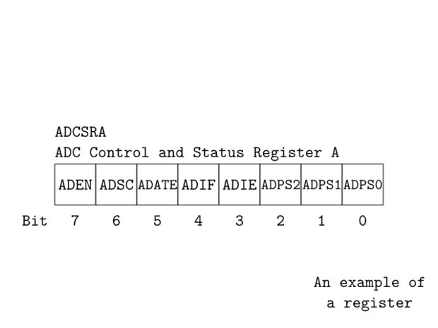
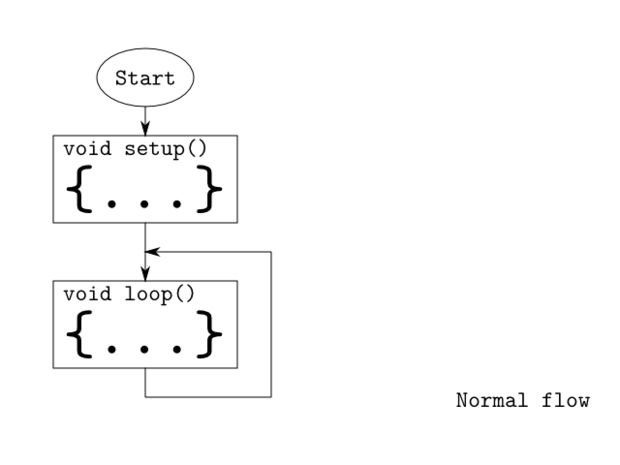
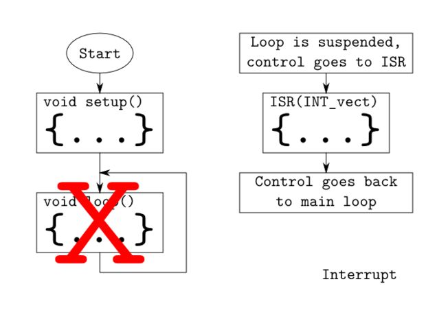
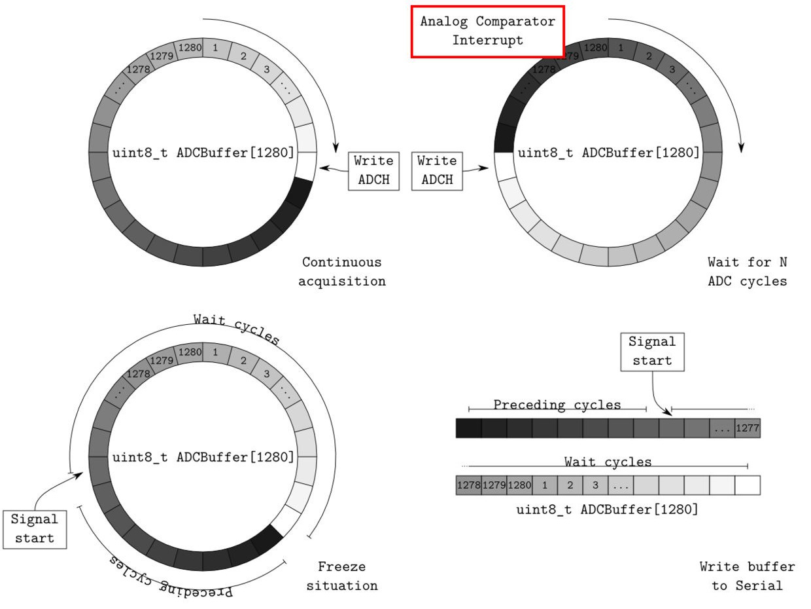
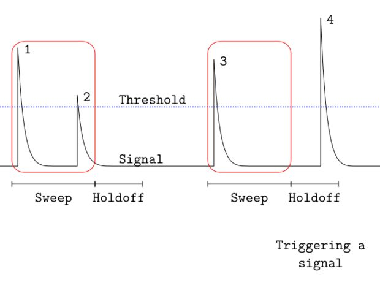
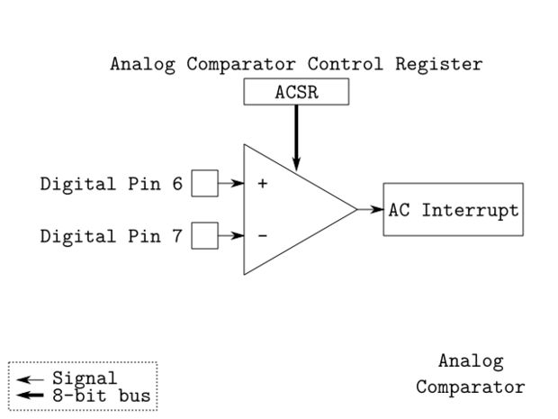
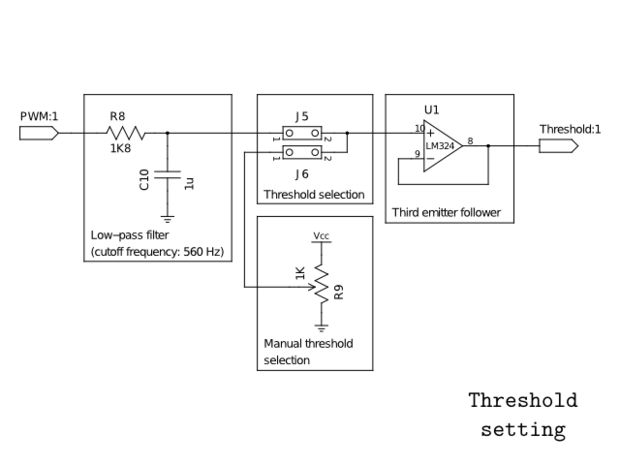
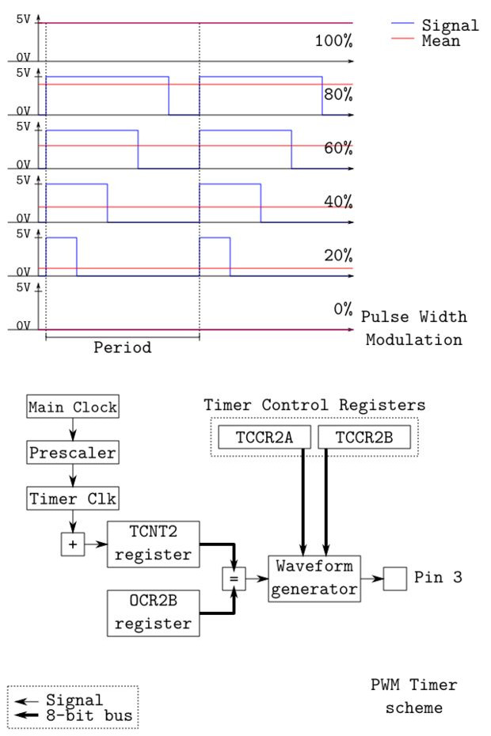

# Fast Arduino Oscilloscope

This post was written to build a  homebrew Arduino Oscilloscope. The serial port is slow and sending every result of an analogRead() through it is a bottleneck.

These were the starting points of the oscilloscope:

- the incoming signal should be decoupled from the arduino to preserve it;
- with an offset of the signal it is possible to see negative signals;
- the data should be buffered;
- a hardware trigger is required to catch the signals;
- a circular buffer can give the signal shape prior to the trigger (more to follow on this point);
- using lower lever functions that the standard ones makes the program run faster.

## What You Need

an Arduino board and the datasheet of the ATMega328P.

The datasheet can be found here: [http://www.atmel.com/images/doc8282.pdf](http://www.atmel.com/images/doc8282.pdf).

## Debug Output

I usually print the debug output to make me keep track of anything that happens. Because Arduino doesn't have a stdout to write to, I will use the Serial port as a stdout. The definition is inside a preprocessor macro, when you want to disable the debug mode, it is simple.

```c
#if DEBUG == 1
#define dprint(expression) Serial.print("# "); Serial.print( #expression ); Serial.print( ": " ); Serial.println( expression )
#define dshow(expression) Serial.println( expression )
#else
#define dprint(expression)
#define dshow(expression)
#endif
```

## Setting Register Bits



Image source from [here](http://www.instructables.com/id/Girino-Fast-Arduino-Oscilloscope/)

With the purpose of being fast, it is necessary to manipulate the microcontroller features with lower lever functions than the standard ones provided by the Arduino IDE. The internal functions are managed through some registers, that are collections of eight bits where each one governs something particular. Each register contains eight bits because the ATMega328P has an 8-bit architecture.

The registers have some names that are specified in the dataset depending on their meanings, like ADCSRA for the ADC Setting Register A. Also each meaningful bit of the registers has a name, like ADEN for the ADC Enable Bit in the ADCSRA register.

To set their bits we could use the usual C syntax for binary operation, but I found on the internet a couple of macros that are very nice and clean:

```c
// Defines for setting and clearing register bits
#ifndef cbi
#define cbi(sfr, bit) (_SFR_BYTE(sfr) &= ~_BV(bit))
#endif
#ifndef sbi
#define sbi(sfr, bit) (_SFR_BYTE(sfr) |= _BV(bit))
#endif
```

Using them is very simple, if we want to set to 1 the Enable Bit of the ADC we can just write:

```c
sbi(ADCSRA,ADEN);
```

While if we want to set it to 0 (id est clear it) we can just write:

```c
cbi(ADCSRA,ADEN);
```

## What are the Interrupts





Image source from [here](http://www.instructables.com/id/Girino-Fast-Arduino-Oscilloscope/)

As we will see in the next steps, the use of interrupts is required in this project. *Interrupts* are signals that tell the microcontroller to stop the execution of the main loop and pass it to some special functions.

The functions that are executed are called *Interrupt Service Routines* (ISR) and are more or less simple functions, but that do not take arguments.

Let us see an example, something like counting some pulses. The ATMega328P has an Analog Comparator that has an interrupt associated that is activated when a signal surpasses a reference voltage. First of all you must define the function that will be executed:

```c
ISR(ANALOG_COMP_vect)
{
    counter++;
}
```

The instruction ISR() is a macro that tells the compiler that the following function is an Iterrupt Service Routine. While ANALOG_COMP_vect is called *Interrupt Vector* and it tells the compiler which interrupt is associated to that routine. In this case it is the Analog Comparator Interrupt. So everytime that the comparator sees a signal bigger than a reference it tells the microcontroller to execute that code, *id* est in this case to increment that variable.

The next step is to enable the interrupt associated. To enable it we must set the ACIE (Analog Comparator Interrupt Enable) bit of the ACSR (Analog Comparator Setting Register) register:

```c
sbi(ACSR,ACIE);
```

In the following site we can see the list of all Interrupt Vectors:
[http://www.nongnu.org/avr-libc/user-manual/group__avr__interrupts.html](http://www.nongnu.org/avr-libc/user-manual/group__avr__interrupts.html)


## Continuously Acquire With a Circular Buffer

The concept of using a Circular Buffer is pretty straight forward:

`Acquire continuously till a signal is found, then send the digitized signal to the computer.`

This approach allows to have the incoming signal shape also before the trigger event.



The following points are referring to the above images.

- On the top-left image, we can see what is continuous acquistion. A buffer is used to store the data, in this case, an array with 1280 slots, then we start to continuously read the ADC output register (ADCH) and fill the buffer with the data. When we get to the end of the buffer we restart from the beginning without clearing it.

- On the top-right imgage, when the signal surpasses the threshold, the Analog Comparator Interrupt is activated. Then we start a waiting phase in which we continue to acquire the signal but keep a count of the ADC cycles that passed from the Analog Comparator Interrupt.

- Bottom-left: When we waited for N cycles (with N < 1280), we freeze the situation and stop the ADC cycles. So we end up with a buffer filled with the digitization of the signal temporal shape. The great part of of this, is that we have also the shape prior to the trigger event, because we were already acquiring before that.

- Bottom-right: Now we can send the whole buffer to the serial port in a block of binary data, instead of sending the single ADC reads. This reduced the overhead required to send the data and the bottleneck of the sketches that I found on the internet.

## Oscilloscope Triggering

An oscilloscope shows on its display a signal, but how can it shows it steadily and do not show it jumping around the screen? It has an internal trigger that is able to show the signal always on the same position of the screen (or at least most of the times), creating the illusion of  atable plot.

The trigger is associated with a threshold that activates a *sweep* when the signal passes it. A sweep is the phase in which the oscilloscope records and displays the signal. After a sweep another phase occurs: the holdoff, in which the oscilloscope rejects any incoming signal. The holdoff period can be composed of a part of dead time, in which the oscilloscope is unable to accept any signal, and a part that can be user selectable. The dead time can be caused by various reasons like having to draw on the screen or having to store the data somewhere.



Image source from [here](http://www.instructables.com/id/Girino-Fast-Arduino-Oscilloscope/)

From the above image:
- Singal 1 surpasses the threhold and activates the sweep;
- Singal 2 is inside the sweep time and gets caught with the first;
- After the holdoff, signal 3 activates the sweep again;
- Instead signal 4 is rejected because it falls inside the holdoff region.

Here, we will know what we need:

`1.` a threshold level to which we can compare the incoming signal;

`2.` a signal that tells the microcontroller to start the waiting phase.

We have several possible solutions for point 1:
- using a trimmer we can manually set a voltage level;
- using the PWM of the Arduino we can set the level by software;
- using the 3.3V provided by the Arduino itseld;
- using the internal bangap reference we can use a fixed level.

For point 2, we have the right solution:
- using the interrupt of the inernal Analog Comparator of the microcontroller.

## How the ADC works

The Arduino microcontroller features a single 10-bit successive approximation ADC. Before the ADC there is an analog multiplexer that lets us send, to the ADC, the signals from different pins and sources (but only one at a time).

Successive Approximation ADC means that the ADC takes 13 clock cycles to complete the conversion (and 25 clock cycles for the first conversion). There is a clock signal dedicated to the ADC that is "computed" from the main clock of the Arduino; this is because the ADC is a little slow and can not keep up with the pace of the other parts of the microcontroller. It requires an input clock frequency between 50 kHz and 200 kHz to get maximum resolution. If a lower resolution than 10 bits is needed, the input clock frequency to the ADC can be higher than 200 kHz to get a higher sample rate.

But how much higher rates can we use? There are a couple of good guides about the ADC at the Open Music Labs:

- [http://www.openmusiclabs.com/learning/digital/atmega-adc/](http://www.openmusiclabs.com/learning/digital/atmega-adc/)
- [http://www.openmusiclabs.com/learning/digital/atmega-adc/in-depth/](http://www.openmusiclabs.com/learning/digital/atmega-adc/in-depth/)

Since my purpose is to get a fast oscilloscope I decided to limit the precision to 8-bits. This has several bonuses:

- the data buffer can store more data;
- you do not waste 6-bits of RAM per datum;
- the ADC can acquire faster.

The prescaler lets us divide the frequency, by some factors, by setting the ADPS0-1-2 bits of the ADCSRA register. From the following plot, we can see that for 8-bit precision the frequency could go up to 1.5 MHz. But since the ability of changing the prescaler factor lets us change the acquisition rate, we can use it also to change the timescale of the oscilloscope. 


There is a good feature about the output registers: we can decide the adjusting of conversion bits, by setting the ADLAR bit in the ADMUX register. If it is 0 they are right adjusted and vice versa. Since I wanted 8-bits precision I set it to 1 so I could read just the ADCH register and ignore the ADCL.

I decided to have just one input channel to avoid having to switch channel back and forth at every conversion.

One last thing about the ADC, it has different running modes each one with a different trigger source:

- Free Running mode
- Analog Comparator
- External Interrupt Request 0
- Timer/Counter0 Compare Match A
- Timer/Counter0 Overflow
- Timer/Counter1 Compare Match B
- Timer/Counter1 Overflow
- Timer/Counter1 Capture Event

I was interested in the free running mode that is a mode in which the ADC continuously converts the input and throws an Interrupt at the end of each conversion (associated vector: ADC_vect).


## Digital Input Buffers

The analog input pins of the Arduino can also be used as digital I/O pins, therefore they have an input buffer for digital functions. If we want to use them as analog pins you should disable this feature.

Sending an analog signal to a digital pin includes it to toggle between HIGH and LOW states, especially if the signal is near the boundary between the two states: this toggling induces some noise to the near circuits like the ADC itself (and induces a higher energy consumption).

To disable the digital buffer we should set the ADCnD bits of the DIDR0 register:

```c
// DIDR0 settings
// When this bit is written logic one, the digital input buffer on the 
// corresponding ADC pin is disabled. The corresponding PIN Register
// bit will always read as zero when this bit is set. When an analog
// signal is applied to the ADC5..0 pin and the digital input from this
// pin is not needed, this bit should be written logic one to reduce
// power consumption in the digital input buffer.
// Note that ADC pins ADC7 and ADC6 do not have digital input buffers,
// and therefore do not require Digital Input Disable bits.

sbi(DIDR0,ADC5D);
sbi(DIDR0,ADC4D);
sbi(DIDR0,ADC3D);
sbi(DIDR0,ADC2D);
sbi(DIDR0,ADC1D);
sbi(DIDR0,ADC0D);
```

## Setting up the ADC

In the sketch, I wrote a initializatin functions that sets-up all the parameters of the ADC functioning. As I tend to write clean and commented code, I will just past the function here. We can refer to the preceding step and to the comments for the meaning of the registers.

```c
void initADC(void)
{
        //---------------------------------------------------------------------
        // ADMUX settings
        //---------------------------------------------------------------------
        // These bits select the voltage reference for the ADC. If these bits
        // are changed during a conversion, the change will not go in effect
        // until this conversion is complete (ADIF in ADCSRA is set). The
        // internal voltage reference options may not be used if an external
        // reference voltage is being applied to the AREF pin.
        // REFS1 REFS0 Voltage reference
        // 0 0 AREF, Internal Vref turned off
        // 0 1 AVCC with external capacitor at AREF pin
        // 1 0 Reserved
        // 1 1 Internal 1.1V Voltage Reference with external
        //   capacitor at AREF pin
        cbi(ADMUX,REFS1);
        sbi(ADMUX,REFS0);
        // The ADLAR bit affects the presentation of the ADC conversion result
        // in the ADC Data Register. Write one to ADLAR to left adjust the
        // result. Otherwise, the result is right adjusted. Changing the ADLAR
        // bit will affect the ADC Data Register immediately, regardless of any
        // ongoing conversions.
        sbi(ADMUX,ADLAR);
        // The value of these bits selects which analog inputs are connected to
        // the ADC. If these bits are changed during a conversion, the change
        // will not go in effect until this conversion is complete (ADIF in
        // ADCSRA is set).
        ADMUX |= ( ADCPIN & 0x07 );

        //---------------------------------------------------------------------
        // ADCSRA settings
        //---------------------------------------------------------------------
        // Writing this bit to one enables the ADC. By writing it to zero, the
        // ADC is turned off. Turning the ADC off while a conversion is in
        // progress, will terminate this conversion.
        cbi(ADCSRA,ADEN);
        // In Single Conversion mode, write this bit to one to start each
        // conversion. In Free Running mode, write this bit to one to start the
        // first conversion. The first conversion after ADSC has been written
        // after the ADC has been enabled, or if ADSC is written at the same
        // time as the ADC is enabled, will take 25 ADC clock cycles instead of
        // the normal 13. This first conversion performs initialization of the
        // ADC. ADSC will read as one as long as a conversion is in progress.
        // When the conversion is complete, it returns to zero. Writing zero to
        // this bit has no effect.
        cbi(ADCSRA,ADSC);
        // When this bit is written to one, Auto Triggering of the ADC is
        // enabled. The ADC will start a conversion on a positive edge of the
        // selected trigger signal. The trigger source is selected by setting
        // the ADC Trigger Select bits, ADTS in ADCSRB.
        sbi(ADCSRA,ADATE);
        // When this bit is written to one and the I-bit in SREG is set, the
        // ADC Conversion Complete Interrupt is activated.
        sbi(ADCSRA,ADIE);
        // These bits determine the division factor between the system clock
        // frequency and the input clock to the ADC.
        // ADPS2 ADPS1 ADPS0 Division Factor
        // 0 0 0 2
        // 0 0 1 2
        // 0 1 0 4
        // 0 1 1 8
        // 1 0 0 16
        // 1 0 1 32
        // 1 1 0 64
        // 1 1 1 128
        sbi(ADCSRA,ADPS2);
        sbi(ADCSRA,ADPS1);
        sbi(ADCSRA,ADPS0);

        //---------------------------------------------------------------------
        // ADCSRB settings
        //---------------------------------------------------------------------
        // When this bit is written logic one and the ADC is switched off
        // (ADEN in ADCSRA is zero), the ADC multiplexer selects the negative
        // input to the Analog Comparator. When this bit is written logic zero,
        // AIN1 is applied to the negative input of the Analog Comparator.
        cbi(ADCSRB,ACME);
        // If ADATE in ADCSRA is written to one, the value of these bits
        // selects which source will trigger an ADC conversion. If ADATE is
        // cleared, the ADTS2:0 settings will have no effect. A conversion will
        // be triggered by the rising edge of the selected Interrupt Flag. Note
        // that switching from a trigger source that is cleared to a trigger
        // source that is set, will generate a positive edge on the trigger
        // signal. If ADEN in ADCSRA is set, this will start a conversion.
        // Switching to Free Running mode (ADTS[2:0]=0) will not cause a
        // trigger event, even if the ADC Interrupt Flag is set.
        // ADTS2 ADTS1 ADTS0 Trigger source
        // 0 0 0 Free Running mode
        // 0 0 1 Analog Comparator
        // 0 1 0 External Interrupt Request 0
        // 0 1 1 Timer/Counter0 Compare Match A
        // 1 0 0 Timer/Counter0 Overflow
        // 1 0 1 Timer/Counter1 Compare Match B
        // 1 1 0 Timer/Counter1 Overflow
        // 1 1 1 Timer/Counter1 Capture Event
        cbi(ADCSRB,ADTS2);
        cbi(ADCSRB,ADTS1);
        cbi(ADCSRB,ADTS0);

        //---------------------------------------------------------------------
        // DIDR0 settings
        //---------------------------------------------------------------------
        // When this bit is written logic one, the digital input buffer on the
        // corresponding ADC pin is disabled. The corresponding PIN Register
        // bit will always read as zero when this bit is set. When an analog
        // signal is applied to the ADC5..0 pin and the digital input from this
        // pin is not needed, this bit should be written logic one to reduce
        // power consumption in the digital input buffer.
        // Note that ADC pins ADC7 and ADC6 do not have digital input buffers,
        // and therefore do not require Digital Input Disable bits.
        sbi(DIDR0,ADC5D);
        sbi(DIDR0,ADC4D);
        sbi(DIDR0,ADC3D);
        sbi(DIDR0,ADC2D);
        sbi(DIDR0,ADC1D);
        sbi(DIDR0,ADC0D);
```


## How the Analog Comparator works

The Analog Comparator is an internal module of the microcontroller and it compares the input values on the positive pin (Digital Pin 6) and negative pin (Digital Pin 7). When the voltage on the positive pin is higher than the voltage on the negative pin AIN1, the Analog Comparator outputs a 1 in the ACO bit of the ACSR register.



Image source from [here](http://www.instructables.com/id/Girino-Fast-Arduino-Oscilloscope/)

Optionally, the comparator can trigger an interrupt, exclusive to the Analog Comparator. The associated vector is ANALOG_COMP_vect.

We can also set the interrupt to be launched on a rising edge, falling edge or on a toggle of the state.

The Analog Comparator is just what we need for the triggering connecting out input signal to pin 6, now what is left is a threshold level on pin 7.


## Setting up the Analog Comparator

In the sketch, I wrote another initialization function that sets-up all the parameters of the Analog Comparator functioning. The same issue about ADC digital buffers applies to the Analog Comparator, as we can see on the bottom of the routine.

```c
void initAnalogComparator(void)
{
        //---------------------------------------------------------------------
        // ACSR settings
        //---------------------------------------------------------------------
        // When this bit is written logic one, the power to the Analog
        // Comparator is switched off. This bit can be set at any time to turn
        // off the Analog Comparator. This will reduce power consumption in
        // Active and Idle mode. When changing the ACD bit, the Analog
        // Comparator Interrupt must be disabled by clearing the ACIE bit in
        // ACSR. Otherwise an interrupt can occur when the bit is changed.
        cbi(ACSR,ACD);
        // When this bit is set, a fixed bandgap reference voltage replaces the
        // positive input to the Analog Comparator. When this bit is cleared,
        // AIN0 is applied to the positive input of the Analog Comparator. When
        // the bandgap referance is used as input to the Analog Comparator, it
        // will take a certain time for the voltage to stabilize. If not
        // stabilized, the first conversion may give a wrong value.
        cbi(ACSR,ACBG);
        // When the ACIE bit is written logic one and the I-bit in the Status
        // Register is set, the Analog Comparator interrupt is activated.
        // When written logic zero, the interrupt is disabled.
        cbi(ACSR,ACIE);
        // When written logic one, this bit enables the input capture function
        // in Timer/Counter1 to be triggered by the Analog Comparator. The
        // comparator output is in this case directly connected to the input
        // capture front-end logic, making the comparator utilize the noise
        // canceler and edge select features of the Timer/Counter1 Input
        // Capture interrupt. When written logic zero, no connection between
        // the Analog Comparator and the input capture function exists. To
        // make the comparator trigger the Timer/Counter1 Input Capture
        // interrupt, the ICIE1 bit in the Timer Interrupt Mask Register
        // (TIMSK1) must be set.
        cbi(ACSR,ACIC);
        // These bits determine which comparator events that trigger the Analog
        // Comparator interrupt.
        // ACIS1 ACIS0 Mode
        // 0 0 Toggle
        // 0 1 Reserved
        // 1 0 Falling edge
        // 1 1 Rising edge
        sbi(ACSR,ACIS1);
        sbi(ACSR,ACIS0);
       
        //---------------------------------------------------------------------
        // DIDR1 settings
        //---------------------------------------------------------------------
        // When this bit is written logic one, the digital input buffer on the
        // AIN1/0 pin is disabled. The corresponding PIN Register bit will
        // always read as zero when this bit is set. When an analog signal is
        // applied to the AIN1/0 pin and the digital input from this pin is not
        // needed, this bit should be written logic one to reduce power
        // consumption in the digital input buffer.
        sbi(DIDR1,AIN1D);
        sbi(DIDR1,AIN0D);
}
```

## Threshold




Image source from [here](http://www.instructables.com/id/Girino-Fast-Arduino-Oscilloscope/)

Recalling what we said about the trigger, we can implement these two solutions for the threshold:

- using a trimmer we can manually set a voltage level;
- using the PWM of the Arduino we can set the level by software.

On the image we can see the hardware implementation of the threshold in both paths.

For the manual selection, a multi-turn potentiometer put between +5 V and GND is sufficient.

While for software selection we need a low-pass filter that filters a PWM signal coming from the Arduino. PWM signals (more on this to follow) are square signals with a constant frequency but a variable pulse-width. This variability brings a variable mean value of the signal that can be extracted with a low-pass filter. A good cutoff frequency for the filter is about one hundredth of the PWM frequency and I chose about 560 Hz.

After the two threshold sources I inserted a couple of pins that allows to select, with a jumper, which source I wanted. After the selection I also added an emitter follower to decouple the sources from the Arduino pin.


## How the pulse width modulation works



Image source from [here](http://www.instructables.com/id/Girino-Fast-Arduino-Oscilloscope/)

As stated before, a Pulse Width Modulation (PWM) signal is a square signal with fixed frequency but variable width. On the image we see an example. On each row there is one of such signals with a different duty cycle (id est the period portion in which the signal is High). Taking the mean signal over a period, we get the red line that correspond to the duty cycle with respect to the signal maximum.

Electronically "taking the mean of a signal" can be translated to "passing it to a low-pass filter", as seen on the preceding step.

In the ATMega328P there are three timers that can be used to generate PWM signals, each one of those has different characteristics that you can use. For each timer correspond two registers called Output Compare Registers A/B (OCRnx) that are used to set the signal duty cycle.

As for the ADC there is a prescaler (see image), that slows down the main clock to have a precise control of the PWM frequency. The slowed down clock is fed to a counter that increments a Timer/Counter Register (TCNTn). This register is continuously compared to the OCRnx, when they are equal a signal is sent to a Waveform Generator that generate a pulse on the output pin. So the trick is setting the OCRnx register to some value to change the mean value of the signal.

If we want a 5 V signal (maximum) we must set a 100% duty cycle or a 255 in the OCRnx (maximum for a 8-bit number), while if we want a 0.5 V signal we must set a 10% duty cycle or a 25 in the OCRnx.

If we want a 5 V signal (maximum) we must set a 100% duty cycle or a 255 in the OCRnx (maximum for a 8-bit number), while if we want a 0.5 V signal we must set a 10% duty cycle or a 25 in the OCRnx.

Since the clock has to fill the TCNTn register before starting from the beginning for a new pulse the output frequency of the PWM is:

```c
f = (Main clock) / prescaler / (TCNTn maximum)
```

exempli gratia for the Timer 0 and 2 (8-bit) with no prescaler it will be: 16 MHz / 256 = 62.5 KHz while for Timer 1 (16-bit) it will be 16 MHz / 65536 = 244 Hz.

I decided to use the Timer number 2 because
Timer 0 is used internally by the Arduino IDE for functions such as millis();
Timer 1 has an output frequency too slow because it is a 16-bit timer.

In the ATMega328P there are different kinds of operation mode of the timers, but what I wanted was the Fast PWM one with no prescaling to get the maximum possible output frequency.


## Setting Up the PWM

In the sketch, I wrote another initialization function that sets-up all the parameters of the Timer functioning and initializes a couple of pins.

```c
void initPins(void)
{
        //---------------------------------------------------------------------
        // TCCR2A settings
        //---------------------------------------------------------------------
        // These bits control the Output Compare pin (OC2A) behavior. If one or
        // both of the COM2A1:0 bits are set, the OC2A output overrides the
        // normal port functionality of the I/O pin it is connected to.
        // However, note that the Data Direction Register (DDR) bit
        // corresponding to the OC2A pin must be set in order to enable the
        // output driver.
        // When OC2A is connected to the pin, the function of the COM2A1:0 bits
        // depends on the WGM22:0 bit setting.
        //
        // Fast PWM Mode
        // COM2A1 COM2A0
        // 0 0 Normal port operation, OC2A disconnected.
        // 0 1 WGM22 = 0: Normal Port Operation, OC0A Disconnected.
        //   WGM22 = 1: Toggle OC2A on Compare Match.
        // 1 0 Clear OC2A on Compare Match, set OC2A at BOTTOM
        // 1 1 Clear OC2A on Compare Match, clear OC2A at BOTTOM
        cbi(TCCR2A,COM2A1);
        cbi(TCCR2A,COM2A0);
        sbi(TCCR2A,COM2B1);
        cbi(TCCR2A,COM2B0);

        // Combined with the WGM22 bit found in the TCCR2B Register, these bits
        // control the counting sequence of the counter, the source for maximum
        // (TOP) counter value, and what type of waveform generation to be used
        // Modes of operation supported by the Timer/Counter unit are:
        // - Normal mode (counter),
        // - Clear Timer on Compare Match (CTC) mode,
        // - two types of Pulse Width Modulation (PWM) modes.
        //
        // Mode WGM22 WGM21 WGM20 Operation TOP
        // 0 0 0 0 Normal  0xFF
        // 1 0 0 1 PWM  0xFF
        // 2 0 1 0 CTC  OCRA
        // 3 0 1 1 Fast PWM 0xFF
        // 4 1 0 0 Reserved -
        // 5 1 0 1 PWM  OCRA
        // 6 1 1 0 Reserved -
        // 7 1 1 1 Fast PWM OCRA
        cbi(TCCR2B,WGM22);
        sbi(TCCR2A,WGM21);
        sbi(TCCR2A,WGM20);

        //---------------------------------------------------------------------
        // TCCR2B settings
        //---------------------------------------------------------------------
        // The FOC2A bit is only active when the WGM bits specify a non-PWM
        // mode.
        // However, for ensuring compatibility with future devices, this bit
        // must be set to zero when TCCR2B is written when operating in PWM
        // mode. When writing a logical one to the FOC2A bit, an immediate
        // Compare Match is forced on the Waveform Generation unit. The OC2A
        // output is changed according to its COM2A1:0 bits setting. Note that
        // the FOC2A bit is implemented as a strobe. Therefore it is the value
        // present in the COM2A1:0 bits that determines the effect of the
        // forced compare.
        // A FOC2A strobe will not generate any interrupt, nor will it clear
        // the timer in CTC mode using OCR2A as TOP.
        // The FOC2A bit is always read as zero.
        cbi(TCCR2B,FOC2A);
        cbi(TCCR2B,FOC2B);

        // The three Clock Select bits select the clock source to be used by
        // the Timer/Counter.
        // CS22 CS21 CS20 Prescaler
        // 0 0 0 No clock source (Timer/Counter stopped).
        // 0 0 1 No prescaling
        // 0 1 0 8
        // 0 1 1 32
        // 1 0 0 64
        // 1 0 1 128
        // 1 1 0 256
        // 1 1 1 1024
        cbi(TCCR2B,CS22);
        cbi(TCCR2B,CS21);
        sbi(TCCR2B,CS20);

        pinMode( errorPin, OUTPUT );
        pinMode( thresholdPin, OUTPUT );

        analogWrite( thresholdPin, 127 );
}
```

## Volatile Variables

I can not remember where, but I read that variables that are modified inside an ISR should be declared as volatile.

Volatile variables are variables that can change during time, even if the program that is running does not modify them. Just like Arduino registers that can change value for some external interventions.

Why does the compiler want to know about such variables? That is because the compiler always tries to optimize the code that we write, to make it faster, and it modifies it a little bit, trying not to change its meaning. If a variable changes by its own it could seem to the compiler that it is never modified during execution of, say, a loop and it could ignore it; while it could be crucial that the variable changes its value. So declaring volatile variables it prevents the compiler to modify the code concerning those.


## Writing the Kernel of the Sketch

Finally we have gotten to the kernel of the program!

As we saw before, I wanted a continuous acquisition and I wrote the ADC Interrupt Service Routine to store in the circular buffer the data continuously. It stops whenever it reaches the index that is equal to stopIndex. The buffer is implemented as circular employing the modulo operator.

```c
//-----------------------------------------------------------------------------
// ADC Conversion Complete Interrupt
//-----------------------------------------------------------------------------
ISR(ADC_vect)
{
        // When ADCL is read, the ADC Data Register is not updated until ADCH
        // is read. Consequently, if the result is left adjusted and no more
        // than 8-bit precision is required, it is sufficient to read ADCH.
        // Otherwise, ADCL must be read first, then ADCH.
        ADCBuffer[ADCCounter] = ADCH;

        ADCCounter = ( ADCCounter + 1 ) % ADCBUFFERSIZE;

        if ( wait )
        {
                if ( stopIndex == ADCCounter )
                {
                        // Freeze situation
                        // Disable ADC and stop Free Running Conversion Mode
                        cbi( ADCSRA, ADEN );

                        freeze = true;
                }
        }
}
```

The Analog Comparator Interrupt Service Routine (that is called when a signal passes the threshold) disables itself and tells the ADC ISR to start the waiting phase and sets the stopIndex.

```c
//-----------------------------------------------------------------------------
// Analog Comparator interrupt
//-----------------------------------------------------------------------------
ISR(ANALOG_COMP_vect)
{
        // Disable Analog Comparator interrupt
        cbi( ACSR,ACIE );

        // Turn on errorPin
        //digitalWrite( errorPin, HIGH );
        sbi( PORTB, PORTB5 );

        wait = true;
        stopIndex = ( ADCCounter + waitDuration ) % ADCBUFFERSIZE;
}
```

## Reference

- [Girino - Fast Arduino Oscilloscope](http://www.instructables.com/id/Girino-Fast-Arduino-Oscilloscope/)
