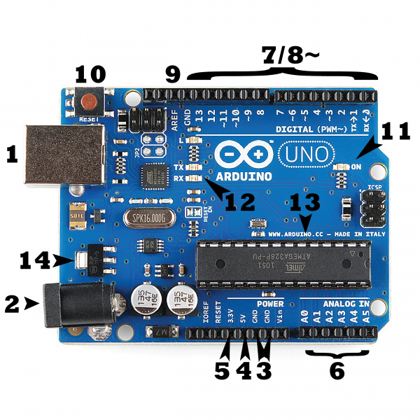

# What is an Arduino?

>Created by iFDING.
>Create Date: 03/11/2017

<b>Reader beware:</b> Arduino conists of both a physical programmable circuit board(microcontroller) and a piece of software, or IDE that runs on pc, used to write and upload code to the physical board.

### Why Arduino

* Doesn't need a separate piece of hardware to load new code onto the board, simply use a USB cable.

* IDE uses a simplified version of C++, making it easier to program.

* It provides a standard form factor that breaks out the functions of the microcontroller into a more accessible package.

### Arduino Uno

[Image source](https://learn.sparkfun.com/tutorials/what-is-an-arduino)

* Power(USB/Barrel Jack)

It can be powered from a USB cable (1) or a AC-to-DC adapter or battery by barrel jack (2).

NOTE: Do NOT use a power supply greater than 20 Volts, recommended voltage: 6 - 12 Volts.

* Pins(5V, 3.3V, GND, Analog, Digital, PWM, AREF)

GND (3): serveral GND pins, any of which can be used to ground a cirtuit.

5V (4) & 3.3V (5): 5V pin supplies 5 volts of power, 3.3V pin supplies 3.3 volts of power.

Analog (6): (A0 through A5), can read the signal from an sensor and convert it into a digital value that we can read.

Digital (7): (0 through 13), can be used for both digital input(like telling if a button is pushed) and digital output(like powering an LED).

PWM (8): the tilde (~) pins (3,5,6,9,10 and 11), act as normal digital pins, but also can be used for Pulse-Width Modulation (PWM), being able to simulate analog output (like fading an LED in and out).

AREF (9): Analog Reference, It is sometimes used to set an external reference voltage (0 - 5V) as upper limit for the analog input pins.

* Reset Button

Reset Button (10): pushing it will temporarily connect the reset pin to ground and restart any code that is loaded on the Arduino.

* Power LED Indicator

A tiny LED next to the word 'ON' (11).

* TX RX LEDs

TX: transmit, RX: receive.

TX and RX (pins 0 and 1) are responsible for serial communication, TX and RX indicator LEDs (12).

* Main IC

IC or Integrated Circuit (13), as the brains of Arduino, usually from the ATmega line

* Voltage Regulator

Voltage Regulator (14): it controls the amount of voltage that is let inot the Arduino board. 

### Reference

* [https://learn.sparkfun.com/tutorials/what-is-an-arduino](https://learn.sparkfun.com/tutorials/what-is-an-arduino)
