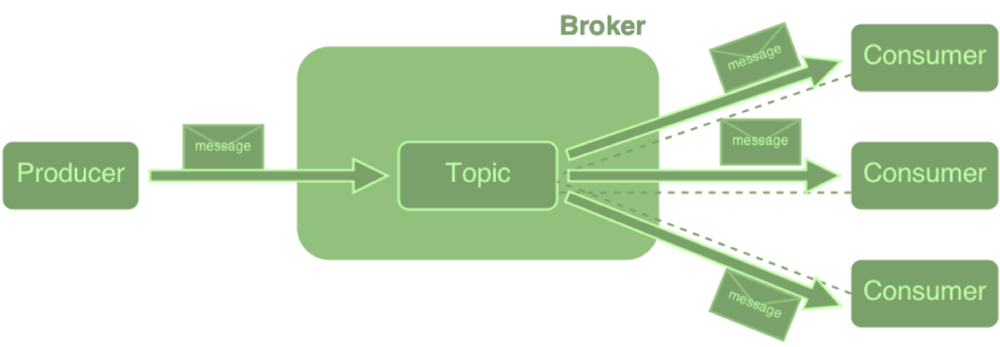
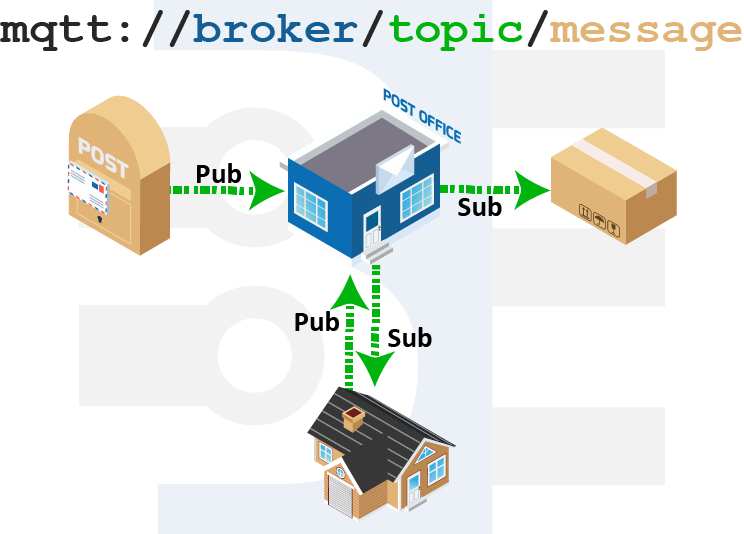
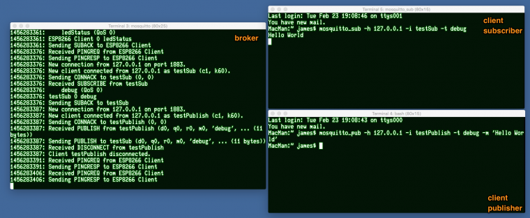
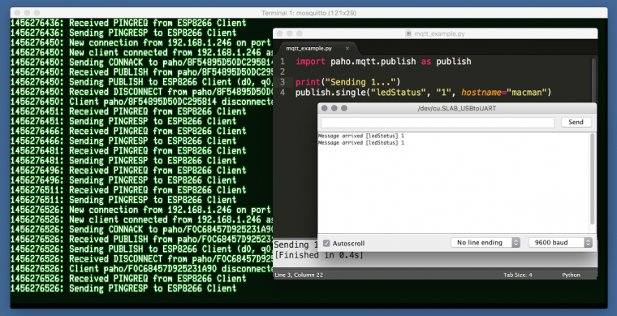

# MQTT for Raspberry Pi and Arduino

### Introduction

#### What is MQTT

* MQTT (MQ Telemetry Transport): a lightweight protocol that's primarily designed for connecting power-constrained devices over low-bandwidth networks.

* For example, a MQTT packet can be as small as 2 bytes, but HTTP has a bunch of junk in the headers.

* M2M (machine to machine communications) and IOT made it a popular protocol.

* Enterprise cloud platforms such as Amazon Web Services, Microsoft Azure, and IBM Watson expose their IoT PaaS through MQTT.


[Image source](https://thenewstack.io/mqtt-protocol-iot/)

* MQTT is just a protocol which has nothing to do with message queues or pub/sub implementations.

* MQTT cannot replace RabbitMQ or any of the enterprise pub/sub engines.

* The fundamental different between MQTT implementation and Message Oriented Middleware (MOM) is the messages are stored and delivered.

* MQTT is not meant for dealing with durable and persistent messages, cannot be considered for implementing the store-and-forward pattern.

* While tranditional MOM is designed for reliable delivery of messages among enterprise applications.

* MQTT is a simper protocol with just five APIs designed to connect devices, cannot be used as the middleware for transactional systems.

#### Message Broker


[Image source](https://thenewstack.io/mqtt-protocol-iot/)

* Decoupling the sender (publisher) with the receiver (subscriber).

* The publishers and subsribers are autonomous, which means they do not need to know the presence of each other.

* Broker: accepts messages from clients and delives them to any interested clients.

* Client: either publishes a message to a topic, subscribes to a topic, or both.

* Topic: a namespace (or place) for messages on the broker. Clients subscribe and publish to a topic.

* Publish: a client sending a message to the broker, using a topic name.

* Subscribe: a client tells the broker which topics interest it.

#### Post Office Analogy


[Image source](https://www.baldengineer.com/mqtt-introduction.html)

### Hands-on with MQTT

Install the broker and clients to see how the messagea are published.

#### Installing Mosquitto

The simplest MQTT broker exists in the form of an open source software called `Mosquitto`.

On a Mac with

```
brew install mosquitto
```

For Linux and Windows, please refer to the [official guide](http://mosquitto.org/download/).

* The Mosquitto binary is available in `/usr/local/Cellar/mosquitto/1.4.11/sbin`.

* It also needs a configuration file with the settings such as bind address, port, client expiration period, and maximum connections.

* The default configuration file available at `/usr/local/etc/mosquitto/mosquitto.conf`.

To launch Mosquitto on a Mac, run the following command:

```
85:sbin feiware$ ./mosquitto -c /usr/local/etc/mosquitto/mosquitto.conf
1489325805: mosquitto version 1.4.11 (build date 2017-02-20 23:45:59+0000) starting
1489325805: Config loaded from /usr/local/etc/mosquitto/mosquitto.conf.
1489325805: Opening ipv4 listen socket on port 1883.
1489325805: Opening ipv6 listen socket on port 1883.

```

#### Testing Mosquitto

Open up two more Terminals

* Subscribing to MQTT Topic with Mosquitto, a topic: "debug"

```
cd /usr/local/Cellar/mosquitto/1.4.11/bin
./mosquitto_sub -h 127.0.0.1 -i testSub -t debug
```

  *The host flag (-h)*, the server running mosquitto, in this case, localhost.

  *The identity flag (-i)*, not required, when a client id is not provided, mosquitto_sub will create one.

  * The topic flag (-t)*, the topic we want to subscribe to, in this case, "debug".

  *Note*, the topic is created when the subscriber or publish first hooks into it, not the server.

* Publish to MQTT topic with Mosquitto

```
cd /usr/local/Cellar/mosquitto/1.4.11/bin
./mosquitto_pub -h 127.0.0.1 -i testPublish -t debug -m 'Hello World'
```


[Image source](https://www.baldengineer.com/mqtt-tutorial.html)

### MQTT for Raspberry Pi

* Install MQTT for Python

```
pip install paho-mqtt
```

* Example MQTT Python Code for Raspberry Pi

```python
import paho.mqtt.publish as publish
import time
print("Sending 0...")
publish.single("ledStatus", "0", hostname="macman")
time.sleep(1)
print("Sending 1...")
publish.single("ledStatus", "1", hostname="macman")
```

Tell the script the hostname of your server (macman), the topic (ledStatus), and the message (0) or (1).

These actions will cause the LED on the ESP8266 to turn off and then turn on.


[Image source](https://www.baldengineer.com/mqtt-tutorial.html)

Now the Raspberry Pi is sending MQTT messages, the next section gets the Arduino receiving messages on the topic "ledStatus" and blink an actual LED!

### MQTT for Arduino

*PubSubClient* is an Arduino-based MQTT client.

Installing *PubSubClient* for the Arduino IDE from GitHub or use the Arduino Package Installer.


[Image source](https://www.baldengineer.com/mqtt-tutorial.html)

* Code Examplefor Arduino MQTT

Here's the code for connecting to WiFi and subscribing to the topic "ledStatus". When the ESP8266 receives a message, it acts by turning the "ledPin" on or off.

```cpp
#include <EEPROM.h>
#include <ESP8266WiFi.h>
#include <PubSubClient.h>
#include <Wire.h>
#include <Adafruit_INA219.h>
 
// Connect to the WiFi
const char* ssid = "Dear John";
const char* password = "password123";
const char* mqtt_server = "macman";
 
WiFiClient espClient;
PubSubClient client(espClient);
 
const byte ledPin = 0; // Pin with LED on Adafruit Huzzah
 
void callback(char* topic, byte* payload, unsigned int length) {
 Serial.print("Message arrived [");
 Serial.print(topic);
 Serial.print("] ");
 for (int i=0;i<length;i++) {
  char receivedChar = (char)payload[i];
  Serial.print(receivedChar);
  if (receivedChar == '0')
  // ESP8266 Huzzah outputs are "reversed"
  digitalWrite(ledPin, HIGH);
  if (receivedChar == '1')
   digitalWrite(ledPin, LOW);
  }
  Serial.println();
}
 
 
void reconnect() {
 // Loop until we're reconnected
 while (!client.connected()) {
 Serial.print("Attempting MQTT connection...");
 // Attempt to connect
 if (client.connect("ESP8266 Client")) {
  Serial.println("connected");
  // ... and subscribe to topic
  client.subscribe("ledStatus");
 } else {
  Serial.print("failed, rc=");
  Serial.print(client.state());
  Serial.println(" try again in 5 seconds");
  // Wait 5 seconds before retrying
  delay(5000);
  }
 }
}
 
void setup()
{
 Serial.begin(9600);
 
 client.setServer(mqtt_server, 1883);
 client.setCallback(callback);
 
 pinMode(ledPin, OUTPUT);
}
 
void loop()
{
 if (!client.connected()) {
  reconnect();
 }
 client.loop();
}
```

*Notice:* HIGH and LOW are reversed for the LED pin...

All of the magic happens inside of the function "callback".

### Conclusion

MQTT is the most preferred protocol for M2M and IoT applications. Based on the pub/sub pattern, it simplifies the connectivity between devices.

This post shows the minimum necessary to connect a Raspberry Pi, Arduino to a PC running an MQTT Broker.

### Reference

* [Get to Know MQTT: The Messaging Protocol for the Internet of Things](https://thenewstack.io/mqtt-protocol-iot/)
* [MQTT Introduction and Tutorial Part One](https://www.baldengineer.com/mqtt-introduction.html)
* [MQTT Tutorial for Raspberry Pi, Arduino, and ESP8266](https://www.baldengineer.com/mqtt-tutorial.html)

