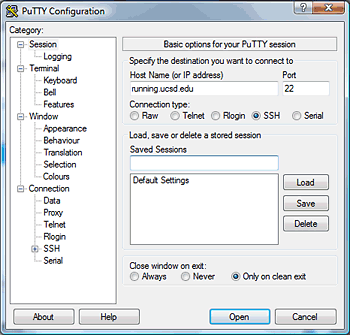
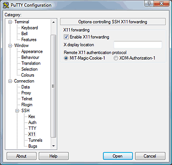

# Creating a virtual desktop from your laptop using SSH and VNC

## X11 on Raspberry Pi

X11 (or Xwindows) is method of remotely logging into a linux/unix machine. It appeared a long way before VNC, RemoteDesktop, WebEx, GotoMyPC and other remote control software. In fact, it pre-dates many windowing systems.

### Configure a remote host in PuTTY (Windows)

Type the full host name into the **Host Name** field.



In the left pane, expand the **SSH** tree by clicking the +.

Select **X11**.

Check **Enable X11 Forwarding**.



## VNC (Virtual Network Computing)

VNC is a graphical desktop sharing system that allows you to remotely control the desktop interface of one computer (running VNC Server) from another computer or mobile device (running VNC Viewer). VNC Viewer transmits the keyboard and either mouse or touch events to VNC Server, and receives updates to the screen in return.


### Enabling VNC Server
```sh
sudo apt-get update
sudo apt-get install realvnc-vnc-server realvnc-vnc-viewer
```

- Enabling VNC Server Graphically
  - On your Raspberry Pi, boot into the graphical desktop.
  - Select Menu > Preferences > Raspberry Pi Configuration > Interfaces.
  - Ensure VNC is Enabled.
- Enabling VNC Server at the command line
```sh
sudo raspi-config
```
  - Navigate to Interfacing Options.
  - Scroll down and select VNC > Yes.

### Creating a virtual desktop

To create and connect to a virtual desktop:

- On your Raspberry Pi (using Terminal or via SSH), run vncserver. Make note of the IP address/display number that VNC Server will print to your Terminal (e.g. 192.167.5.149:1).

- On the device you'll use to take control, enter this information into VNC Viewer.

To destroy a virtual desktop, run the following command:
```sh
vncserver -kill :<display-number>
```

## VNC VS X11

One of the main differences between VNC and x11 is that VNC sends all mouse movements to the remote machine, and all screen updates come back as compressed bitmap data. This truly is a live remote connection at the lowest level. VNC uses compression, so this performs better than you might think, but still it’s quite an inefficient protocol if you have a poor connection to the remote machine.

X11/windows however, runs a X11 display server on the computer you are sitting at, and the programs running on the remote machine just send display update commands in to that server. This is inherently much more efficient, and more flexible. It’s not without it’s problems, but here are some of the neat things you can do with a X11 server.

1. remotely log in to another machine (e.g. via ssh), run a command, and a graphical window pops up on your windows/mac desktop. e.g. on a Raspberry Pi, if you have it all set up and working, typing midori & at a ssh command prompt will start the midori browser, the midori “back end” runs on the raspberry pi, but the window appears on your windows/mac, just as if it was a normal window on that machine.

2. Run multiple display servers on your windows/mac and open windows from multiple remote machines. Each window looks like a native window on the computer you are sitting in front of.

3. Start the desktop server as part of the connection process, and get a complete desktop appear on your windows/mac along with the menu bar and all other assets. You can have multiple simultaneous desktops open to the same machine, or to different machines, and you can also have multiple “untethered” windows open as well.

## Run graphical programs remotely from a Linux server

It is common to want to run graphical applications (such as matlab, mathematica, eclipse, etc) on these Linux servers and display them on their local computers.  This document details the steps required to do this for Mac, Windows, and Linux systems.

### Mac OS X

1. Install XQuartz on your Mac, which is the official X server software for Mac
2. Run Applications > Utilities > XQuartz.app
3. Right click on the XQuartz icon in the dock and select Applications > Terminal.  This should bring up a new xterm terminal windows.
4. In this xterm windows, ssh into the linux system of your choice using the -X argument (secure X11 forwarding).  For example, to log into hulk.soic.indiana.edu you would run something like:
```sh
     ssh -Y username@hulk.soic.indiana.edu
```

5. Once you are logged into the linux system, you can just run the GUI program of your choice (ie. matlab, mathematics, etc) and it will display on your Mac.

### Windows
1. Install the Xming software.
2. If you have not already done so, download putty.exe from the PuTTY site and install it.
3. Run Xming on your PC to start the X server.  You should see the Xming icon in the taskbar if it is running (although you may have to click the little arrow in the taskbar to see it)
4. Run PuTTY and set things up as follows:

- Enter the server name in Host Name
- Make sure the Connection type is set to SSH
- Enable X11 forwarding (Connection > SSH > X11)

5. Log in using your normal IU username and passphrase
6. Once you are logged into the linux system, you can just run the GUI program of your choice (ie. matlab, mathematics, etc) and it will display on your PC.

### Linux

1. ssh into the linux system of your choice using the -Y argument (secure X11 Forwarding).  For example, to log into hulk.soic.indiana.edu you would run something like: 
```sh
    ssh -Y username@hulk.soic.indiana.edu
```

2. Once you are logged into the remote linux system, you can just run the GUI program of your choice (ie. matlab, mathematics, etc) and it will display on your Mac.

### Alternate Method Using RDP

The methods listed above are recommended because they put the least amount of load on the servers and should provide adequate performance.  

However, there is an alternate method using RDP (Remote Desktop) that will work on some of our Linux servers.  For those systems you can connect using the native Remote Desktop client (Windows), the Microsoft Remote Desktop App (Mac OS X), or either xfreerdp or rdesktop (Linux).  

You will get a full GUI desktop using this method so you can start any GUI application you need. The downside of this approach is that since you are running a full GUI desktop it puts much more load on the server and your performance may suffer.  

For that reason, we urge you to use the above OS-specific methods and only use RDP as a last resort if those do not work for you.

## Reference

* [VNC (VIRTUAL NETWORK COMPUTING)](https://www.raspberrypi.org/documentation/remote-access/vnc/)
* [X11 on Raspberry Pi – remote login from your laptop](http://blog.whaleygeek.co.uk/x11-on-raspberry-pi-remote-login-from-your-laptop/)
* [Remote Desktop using VNC with SSH Tunnel (Windows)](https://crl.ucsd.edu/handbook/vnc/)
* [How do I run graphical programs remotely from a Linux server?](https://uisapp2.iu.edu/confluence-prd/pages/viewpage.action?pageId=280461906)